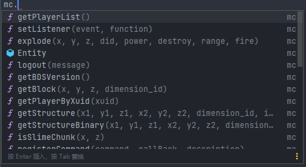
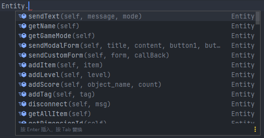
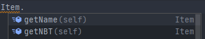
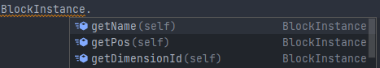
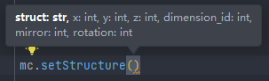
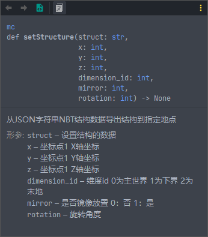
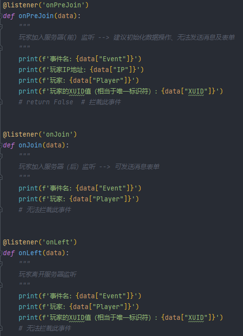
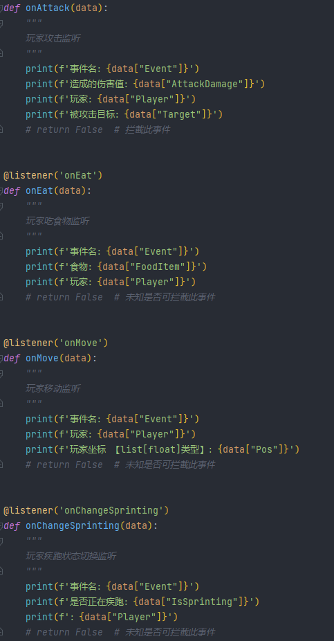

# BDSpyrunner辅助开发模块

**本模块已适配pyr1.9.8**

感谢 [我什么都布吉岛](https://github.com/The-Flash5) 的协助开发

此模块适用于 [twoone3](https://github.com/twoone-3) 开发的BDSpyRunner

[帖子传送门](https://www.minebbs.com/threads/bdspyrunner-python.5949)
[Github传送门](https://github.com/twoone-3/BDSpyrunner)

模块介绍
----

本模块提供pyr函数的自动补全、类型提示等功能

对照pyr源代码以及wiki编写

写pyr插件再也不用去翻wiki了

图骗欣赏
----

**插件模板（一部分）**

*说实话这玩意一部分是我拿代码自动生成的*

使用方法
----

- vscode

  如果打开的是文件夹，将pyi文件扔到插件同文件夹 如果只打开了文件，将pyi文件扔到编辑器打开即可

- pycharm

  将pyi文件扔在py文件同目录即可

tip:插件编写完成后无需将pyi文件扔到服务端

结语
----

最后，祝大家喜欢这个模块

也欢迎提交pull request与issues

*yysy我把这玩意扔到github的原因就是方便大家修改，然后我就可以偷懒啦hiahiahia*（被打）

给个star不过分吧awa

联系方式
---

QQ: 3076823485

E-mail: [lgc2333@126.com](mailto:lgc2333@126.com)

Telegram: [@lgc2333](https://t.me/lgc2333)

BDSpyRunner Group: [QQ](https://jq.qq.com/?_wv=1027&k=pjvwGNly) |
[Telegram](https://t.me/bdspyrunner)

更新记录
----

2021.4.4 适配pyr1.3

2021.4.4b2 适配pyr1.3.4

2021.4.5 修正newThread函数名错误

2021.4.20 适配pyr1.4.1

2021.4.27 增加插件开发模板

2021.5.12 修正一些小错误，添加setTimeout函数，移除newThread函数

2021.5.12b2 稍微修改了一下插件开发示例

2021.6.5 适配pyr1.4.5

2021.6.7 适配pyr1.5.0

2021.6.14 适配pyr1.5.4以及一些小更改

2021.8.5 适配pyr1.6.1以及一些小更改

2021.8.5b2 修正了一些小错误

2021.8.5b3 修正了disconnect的参数错误

2021.8.6 适配pyr1.6.3

2021.8.19 尝试适配pyr1.7.0

2022.1.14 适配pyr1.9.0(by [我什么都布吉岛](https://github.com/The-Flash5))

2022.2.2 适配pyr1.9.5(by [我什么都布吉岛](https://github.com/The-Flash5))

2022.2.4 插件模板重写，模块修正部分内容

2022.2.4-2 添加&修正部分函数

2022.2.6 插件模板添加onServerStarted监听

2022.2.7 适配适配更新更新
